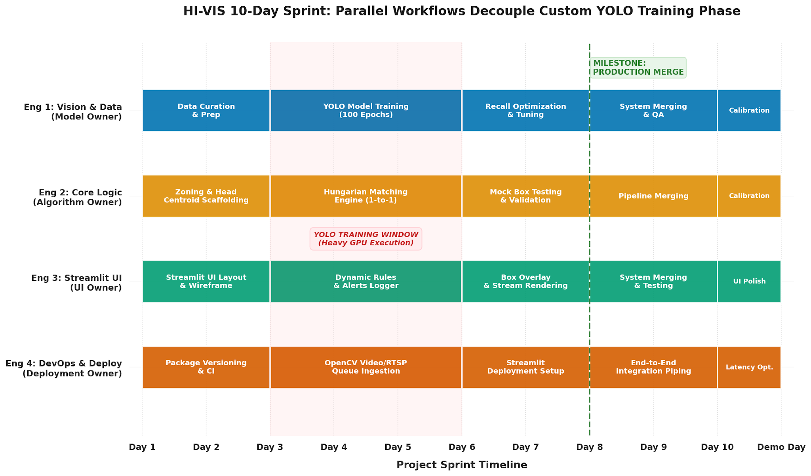

# P0-Safety — HI-VIS Automated AI Safety Compliance System

> Turning raw site photography into searchable, auditable safety evidence.

HI-VIS automates PPE compliance checks on construction sites. Existing site photos (security cameras, handheld) go in — per-person compliance verdicts with localized bounding boxes and filterable exception logs come out.

**Standards in scope:** 29 CFR 1926.100 (Head Protection) · 1926.96 (Foot Protection) · 1926.101/102 (Eye & Respiratory)

---

## Why

Construction is the UK's deadliest sector: **25 fatalities in 2024/25 (HSE)** — 20% of all worker deaths from 6% of the workforce, at **1.92 per 100k** (4.8x the all-industry average). Spot inspections don't scale. HI-VIS provides continuous, data-driven oversight from photography sites already collect.

**Core insight — Positive-Only + Algorithmic Compliance:**

Training on negative classes (`no_hardhat`, `no_boots`) fails catastrophically (Sajjad dataset: **1.8% mAP** on `no_boots` — the model cannot learn an absent object). HI-VIS detects only what is present (`person`, `hardhat`, `vest`, `boots`, `mask`) and applies logic to derive violations.

```
YOLOv26 detects -> Association Layer decides compliance
if person has no hardhat in their zone -> violation (1926.100)
```

---

## How It Works

| Stage | What happens | Key detail |
|---|---|---|
| **1. Data Curation** | Merge & standardize datasets -> unified `data.yaml` | **Roboflow Construction PPE (8,845 images)** as Clean Path to avoid Missing Label Penalty; SODA held-out for domain-shift testing. Drop `no_*` negatives. |
| **2. Preprocessing** | Resize 640x640 + targeted Albumentations | Spatial (rotate/scale) · Environmental (brightness/contrast/shadow for glare) · Noise (motion blur). Critical for boots — smallest & most occluded (1926.96). |
| **3. Detection** | **YOLO26** — single-pass detector (`~20-40ms`/image) | Backbone + Neck (FPN/PAN) + Head. Spatial attention for tiny/occluded PPE (mask mAP 0.40-0.60 on v8 -> higher on v26). See [YOLOv26-explained.md](YOLOv26-explained.md). |
| **4. Association** | Hungarian bipartite matching + head-zone centroid distance | Fixes "Helmet Snatching" in crowds — one hardhat cannot be shared across workers. |
| **5. Output** | Annotated visuals + filterable Exception Log | Searchable safety records: date, file, person, missing PPE. |

```
Image -> [ YOLO26: Backbone -> Neck -> Head ] -> Boxes -> [ Association Engine ] -> Compliance Verdict
```

Full rationale: [implementation plan.md](implementation%20plan.md)

---

## Production Thresholds

Safety-critical = optimize **Recall on Violations** (False Negative = regulatory failure; False Positive = admin annoyance).

- **Head Protection (1926.100) Recall > 0.95**
- **Foot Protection (1926.96) Recall > 0.85**
- **Overall mAP@50 > 0.80**

Evaluated on a held-out test set including SODA for cross-convention domain shift.

---

## 10-Day Sprint Timeline



**New milestone — Start of Model Training (End of Day 2):** `python train.py` can launch 100 epochs on GPU. No Streamlit in scope for this milestone.

| Engineer | Days 1-2 (to Training Ready) | Days 3-10 |
|---|---|---|
| **Eng 1 — Training Pipeline** | GPU cluster, `requirements.txt` (`torch`/`ultralytics`/`opencv-python`), `train.py` (AdamW, cosine LR, batch 32/64), COCO `yolov8n.pt` placeholder | Heavy 100-epoch training + tuning |
| **Eng 2 — Data Curation** | Audit snehilsanyal/Sajjad/Anurag -> unify to Roboflow Clean Path, emit `data.yaml` | Association engine (via placeholder `yolov8n.pt`) |
| **Eng 3 — Augmentation** | Albumentations pipeline + train/val split + visual QA | Dynamic alert / exception logging |
| **Eng 4 — Validation Harness** | `check_dataset.py`, freeze thresholds & held-out set, `model("photo.jpg")->boxes` smoke test | Streamlit deployment (Days 6-7) -> Production Merge |

Decoupling via **Day 2 Handoff**: Eng 1's `yolov8n.pt` placeholder unblocks Eng 2/3/4 for Days 3-5; swapped for `best.pt` on Day 5 with zero code change. Detail: [task parallelization.md](task%20parallelization.md)

Project board: https://github.com/users/rif42/projects/1

---

## Repository

```
P0-safety/
├── implementation plan.md      # 6-section strategic & technical plan
├── YOLOv26-explained.md        # Concise YOLOv26 explainer for the team
├── task parallelization.md     # 4-engineer parallelization strategy
├── hi-vis-timeline.png         # 10-day sprint Gantt
└── README.md                   # (this file)
```

> Upcoming (post-milestone): `dataset/data.yaml`, `train.py`, `augmentations.py`, `check_dataset.py`, `association/`, `app.py` (Streamlit)

---

## Quick Start (after Training Ready milestone)

```bash
# 1. Environment (no Streamlit until Days 6-7)
pip install -r requirements.txt  # torch, ultralytics, opencv-python, albumentations

# 2. Verify dataset
python check_dataset.py --data dataset/data.yaml

# 3. Smoke test (placeholder, Day 2)
python -c "from ultralytics import YOLO; YOLO('yolov8n.pt')('photo.jpg')"

# 4. Launch training (100 epochs, on-prem GPU)
python train.py --data dataset/data.yaml --epochs 100 --batch 32 --optimizer AdamW --lr cosine
# -> runs/best.pt
```

Training config: **100 epochs · AdamW · Cosine LR · Batch 32/64 · On-premise GPU clusters**

---

## Docs

- [Implementation Plan](implementation%20plan.md) — vision, data strategy, augmentation, YOLO26 architecture, association logic, evaluation
- [YOLOv26 Explained](YOLOv26-explained.md) — 30-second how-it-works + why YOLO26 for HI-VIS
- [Task Parallelization](task%20parallelization.md) — 4-engineer bottleneck bypass

---

## License

TBD — add `LICENSE` before public release.
